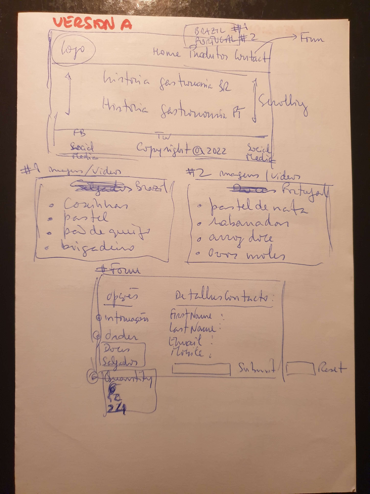
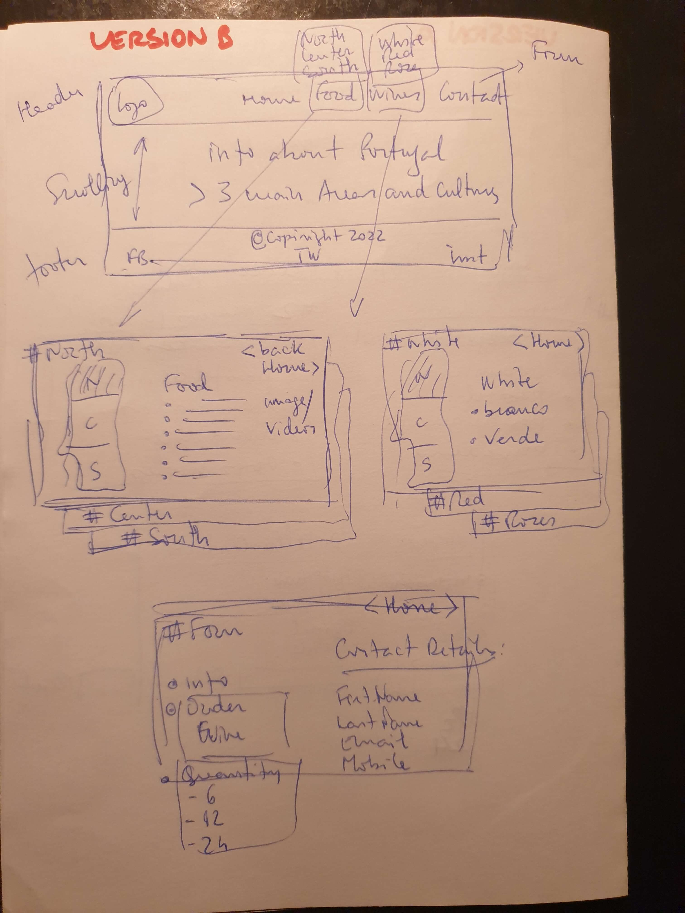
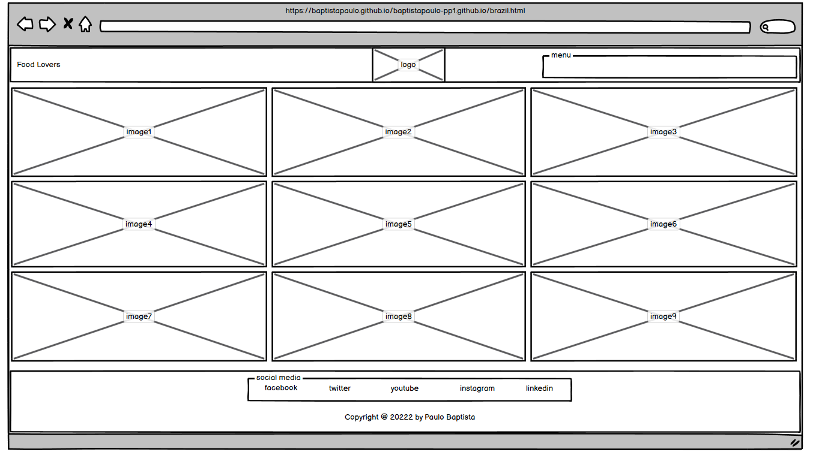
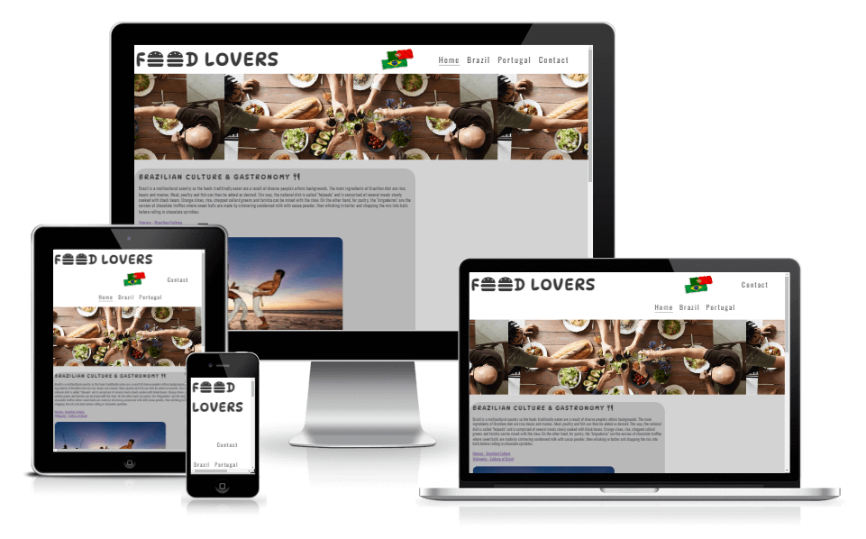

## Table of Contents
* [Purpose](#Purpose)
* [Prototype](#Prototype)
* [Features](#Features)
    * [Existing](#Existing)
        * [Navigation Bar](#Navigation-Bar)
        * [The Header Image](#The-Header-Image)
        * [Main Section](#Main-Section)
        * [Footer](#Footer)
        * [Galleries](#Galleries)
        * [Form](#Form)
    * [Left to Implement](#Left-to-Implement)
* [Technologies](#Technologies)
* [User Experience Design (UX)](#User-Experience-Design)
    * [Structure](#Structure)
    * [Business Goals](#Business-Goals)
    * [User Goals](#User-Goals)
        * [First Time Visitor](#First-Time-Visitor)
        * [Returning Visitor](#Returning-Visitor)
        * [Frequent User](#Frequent-User)
    * [Design](#Design)
        * [Colour Scheme](#Colour-Scheme)
        * [Typography](#Typography)
        * [Wireframes](#Wireframes)
* [Limitations](#Limitations)
* [Testing](#Testing)
    * [Test Results](#Test-Results)
        * [Validators](#Validators)
        * [Devices](#Devices)
    * [Testing Issues](#Testing-Issues)
* [Deployment](#Deployment)
    * [Project Creation](#Project-Creation)
    * [GitHub Pages](#Github-Pages)
    * [Locally](Locally)
    * [Commands](Commands)
* [Credits](#Credits)
    * [Content](#Content)
    * [Media](#Media)
    * [Acknowledgements](#Acknowledgements)
* [Comments](#Comments)

## Purpose
The idea behind this site was to bring some knowledge about the Portuguese and Brazilian gastronomy. There are a lot of sites with massive information regarding culture and food from both countries but on this one, the focus is to centralize and put together some of the most common and representative products.
The portfolio of recipes will provide some basic information about each product and then, if the user wants to get additional information, should contact us by filling the form. 
This site was built with basic functionality and navigation but soon, more advanced features will be deployed such as online orders, request of recipes, requests for further information regarding specific locations (travelling, hotels) and feedback from users. 

The live website can be found [here](https://baptistapaulo.github.io/pp1/index.html).

## Prototype

## Features
### Existing
#### Navigation-Bar
#### The-Header-Image
#### Main-Section
#### Footer
#### Galleries
#### Form
### Left-to-Implement
* Orders online for delivery of some selected products from the portfolio but this will require a secure link for payments and security compliance.
* A blog also may be created but only accessible to members, requiring therefore a registration and sign in.
* A database with multiple recipes may be deployed as a back-end engine to provide a feed of different products, so that every month for example, the front end can swift some of the recipes based on a voting scheme from members.
* Gallery images with the recepy attached underneath.

## Technologies
* Languages
    * HTML5
    * CSS3
* Frameworks, Libraries and Programs
    * Google fonts
    * Font Awesome
    * GitHub (used to store repositories, files and images pushed from GitPod)
    * GitPod (IDE used to code the website)
    * Git (for version control, commits and push to GitHub)
    * Google Chrome Developer Tools (for checking compatibility, troubleshooting and editing code)
    * TinyPNG (for compression of your WEBP, JPEG and PNG files) [here](https://tinypng.com/).

## User-Experience-Design
### Structure
### Business-Goals
* Provide a central repository of gastronomy and cultural information
* Allow users to have access to accurate product details at low fees
* Promote a forum for discussions about culture and gastronomy
* Create and publish a ranking of the most voted products
### User-Goals
#### First-Time-Visitor
* Easy navigation and search for information
* Site should be visually appealing
#### Returning-Visitor
* Leave some feedback
* Contact for further information
#### Frequent-User
* Check if any of the topics posted has been commented
* Find new recipes
* Order some products
### Design
#### Colour-Scheme
#### Typography
#### Wireframes

## Limitations

## Testing
### Test-Results
#### Validators
* HTML - Official W3C validator [here](https://validator.w3.org/).
* CSS - Official (Jigsaw) validator [here](https://jigsaw.w3.org/css-validator/).
* Lighthouse – Developer Tools
* Chrome – Developer Tools
* Am I Responsive [here](https://ui.dev/amiresponsive).

#### Devices
Tested functionality and responsiveness using the below devices and browsers.
Mobiles
* Samsung S9
* Samsung Note
* Samsung A51
Laptops
* HP EliteBook
* Lenovo ThinkPad
Browsers
* Chrome
* Firefox
* Edge

### Testing-Issues
Unfixed Bugs
To mention unfixed bugs and why they were not fixed. This section should include shortcomings of the frameworks or technologies used. 
* Issue 1 if any found
* Issue 2 if any found
No bugs identified that needs to be fixed. Styling and optimization require additional time, but functionality and user experience were the focus for this deployment.

## Deployment
### Project-Creation
#### Github-Pages
Repository
1. Navigate to the GitHub [Repository:](https://github.com/baptistapaulo/pp1)
1. Click the 'Settings' Tab.
1. Scroll Down to the Git Hub Pages Heading.
1. Select 'Master Branch' as the source.
1. Click the Save button.
1. Click on the link to go to the live deployed page.
### Locally
Clone
1. Navigate to the GitHub [Repository:](https://github.com/baptistapaulo/pp1)
1. Click the Code drop down menu.
1. Either Download the ZIP file, unpackage locally and open with IDE (This route ends here) OR Copy Git URL from the HTTPS dialogue box.
1. Open your developement editor of choice and open a terminal window in a directory of your choice.
1. Use the 'git clone' command in terminal followed by the copied git URL.
1. A clone of the project will be created locally on your machine.
### Fork
Most commonly, forks are used to either propose changes to someone else's project to which you do not have write access, or to use someone else's project as a starting point for your own idea. You can fork a repository to create a copy of the repository and make changes without affecting the upstream repository.
So a fork is a copy of a repository. Forking a repository allows you to freely experiment with changes without affecting the original project.
1. Navigate to the GitHub Repository you want to fork.
1. On the top right of the page under the header, click the fork button.
1. Create a new fork.
1. This will create a duplicate of the full project in your GitHub Repository.
### Commands
* `CTRL + S` was used to save the page
* `CTRL + Z` was used to undo a change
* `python3 -m http.server` was used to view and test site before pushing live
* `git add` was used to add pages to the stage area
* `git commit -m "fix: message here"` was used to comit them them to github and provide a relevant message to the changes that had been made.
* `git push` was used to push the changes upto Github for public viewing.

## Credits
### Content
* Text for the main section was created by myself
* Additional information gathered from official sites (for both countries)
* ReadMe structure from Daisy McGirr GitHub repositories
* Code ideas were gathered from **Chris Williams**, **Daisy McGirr** and **kera-cudmore** GitHub repositories

### Media
* The photos used in this website were taken from Free Images
* Pexels.com - used for images
* Unsplash.com - used for images
* Google.com - used for images

### Acknowledgements
* Huge thank you to my mentor **Ronan McClelland** for his guidance throughout my project
* Special thanks to Student Care support (**Aoife**) for assisting me on a delicate health issue

## Comments
the Git Pages contains two different deployments due to a change on the repository name
`github-pages at 307921d` refers to a previous website (**baptistapaulo.github.io/baptistapaulo-pp1.github.io/**)
`github-pages at bd31b90` refers to current website (**baptistapaulo.github.io/pp1/**)